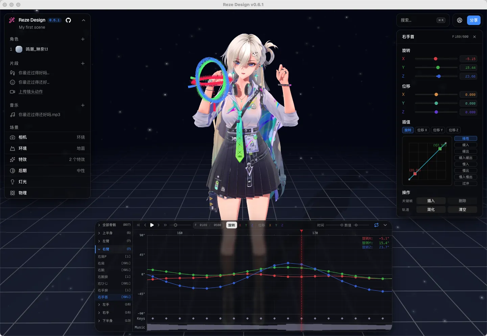

# Reze Design 桌面客户端

**Reze Design Desktop** is a cross-platform desktop app for editing, playing and rendering MMD (MikuMikuDance) models and VMD animation clips, built on top of [reze-design](https://github.com/AmyangXYZ/reze-design). It renders locally in real time via WebGPU and serves the UI from an embedded Next.js server — no external services required. Works on Windows & macOS.

Reze Design Desktop 是一款跨平台的开源 [MMD（MikuMikuDance）](https://sites.google.com/view/vpvp/) 视频渲染软件，支持编辑，播放和渲染 VMD/PMX 格式的模型动画，它是基于 [reze-design](https://github.com/AmyangXYZ/reze-design) 封装的桌面软件，使用 WebGPU 的实时渲染，可以更方便的在本地渲染MMD视频，支持window和MAC。

## 截图



## 功能

- 离线本地渲染导出:Electron 内嵌 `next start`,无需外部服务
- WebGPU 自动检测与说明指引(双显卡/驱动问题排查)
- 发行剥离:内置版权资源(models/animations/audios)不出现在发行包内,打开为空场景,自行导入本地模型
- 在线访问作者站点、检查更新入口(配置于 `config.json`)
- Windows NSIS 向导式安装 / macOS 未签名 dmg(随附放行说明)

## 利用 GitHub Actions 云打包

只想下载安装包、或不想在本地折腾打包环境?可直接用 GitHub Actions 在云端一键打包 Windows 与 macOS 两个平台的安装包:

- **直接下载**:进入仓库 **Actions** 页,选择 `Build Installer (Windows & macOS)` 工作流,Run 一次会同时产出两个平台 → 打开最近一次成功的运行 → 在页面底部 **Artifacts** 下载 `installer-windows-<版本>-<SHA>` / `installer-macos-<版本>-<SHA>`,解压即得 `Reze-Design-Desktop-<版本>-windows-<SHA>-Setup.exe` / `Reze-Design-Desktop-<版本>-macos-<SHA>.dmg`(<SHA> 为上一步对应上游提交的短哈希)。
  > 注意:GitHub Actions 产物(Artifacts)**需要登录 GitHub 账号才能下载**,未登录时看不到下载入口;macOS 版未签名,首次打开若被拦见下方"macOS 未签名放行"。
- **自行打包(Fork)**:Fork 本仓库(保持 public 即可使用 GitHub 公共仓库的免费构建额度)→ 在自己的 Fork 仓库打开 **Actions** → 选择 `Build Installer (Windows & macOS)` 工作流 → **Run workflow**:
  - `upstream_ref` 留空:按仓库**已适配的上游版本**(当前为上游 v0.6.4,对应提交 92e2c6c)打包;
  - 也可填 `latest-commit`(上游默认分支最新提交)/ `latest`(最新 tag)/ 具体 tag 或 commit SHA;
  - `version_override` 可强制指定产物版本号,留空则自动读取上游 `package.json` 的 version;
  - 勾选 `upload_release`(默认不勾)时,构建成功后会把 win/mac 两个安装包上传到该仓库同一个 tag 的 **Pre-release**(可随时删除/编辑/转正式);
  - 构建完成后,同样到自己 Fork 的运行记录底部 **Artifacts** 下载安装包。
- **触发方式**:该工作流为**手动触发**(`workflow_dispatch`),当前**未开启定时自动打包**,即不会自动跟随上游发版出包;构建建议在仓库主页勾选相应 workflow 手动运行。

## 环境要求

- Node.js 22(`.nvmrc` 已锁定)
- 显卡支持 WebGPU(Windows: D3D12;macOS: Metal),详见 `resources/WebGPU-guide.md`

## 开发

```bash
# 拉取时含子模块
git clone --recurse-submodules <repo-url>
cd reze-design-desktop

npm install
npm run dev        # 启动 Electron + reze-design 开发服务器
```

## 打包

```bash
npm run dist        # 完整构建(staging 内注入剥离版场景并 next build)
npm run dist -- --skip-build   # 复用已有 .next(剥离不生效,不建议用于发行)
```

- Windows 产物:`dist/RezeDesign-<version>-Setup.exe`(NSIS 向导式)
- macOS 产物:`dist/RezeDesign-<version>.dmg`(未签名,安装见 `resources/MAC-install.md`)

### macOS 未签名放行(一次即可)

应用未购买 Apple 签名,首次打开可能被 Gatekeeper 拦截;在终端执行一次即可:

```bash
xattr -dr com.apple.quarantine "/Applications/Reze Design.app"
```

> 也可用 `xattr -cr "/Applications/Reze Design.app"` 全清扩展属性;若报"应用已损坏"说明隔离标记在包内,务必用上面这条递归版。
> 右键"打开"、系统设置允许等其它方式见 `resources/MAC-install.md`。

图标由 `build/icon-source.jpg` 生成:

```bash
npm run make-icon   # 产出 build/icon.ico、icon.png、icon.icns
```

## 目录结构

```
electron/            Electron 主进程与 preload
scripts/             dev / dist / make-icon / after-pack
resources/           说明文档 + 发行剥离版默认场景
config.json          在线地址、更新地址、端口
reze-design/         子模块(上游 reze-design v0.6.4)
```

## License

[AGPL-3.0-or-later](LICENSE)


## 致谢
感谢 [AmyangXYZ](https://github.com/AmyangXYZ/) 创建并维护了优秀的 reze-engine MMD WebGPU引擎，以及其他相关项目。
